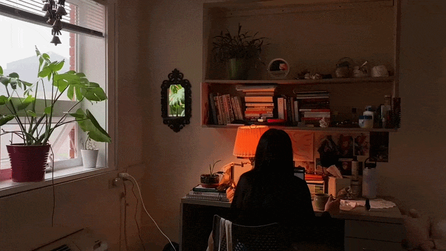
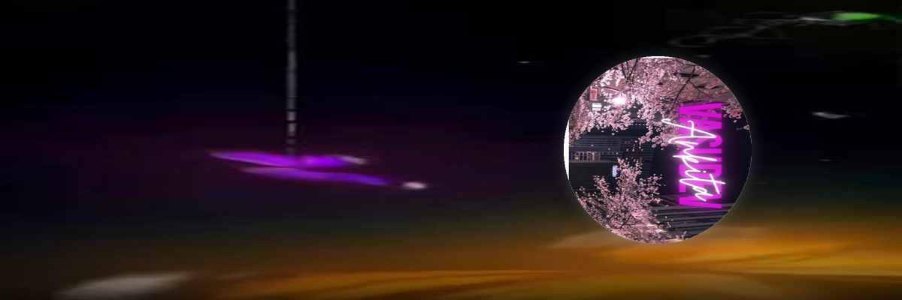



<!-- ===== CINEMATIC STUDY BANNER (GIF) ===== -->

<!-- Aesthetic Name Overlay -->

  <h1 style="font-family: 'Georgia', serif; font-size: 56px; color: #fff; text-shadow: 2px 2px 8px rgba(0,0,0,0.7); letter-spacing: 4px; font-weight: 300;">
    Ankita Salaria
  </h1>
  

    coder · creator · dreamer
  

---

<h1 style="background: linear-gradient(90deg, #4A90D9, #9B59B6, #E74C3C, #4A90D9); background-size: 200% auto; animation: gradient 3s ease infinite; -webkit-background-clip: text; -webkit-text-fill-color: transparent; font-size: 48px; font-weight: bold;">
  Ankita Salaria
</h1>

  <i>"Turning caffeine into code, one commit at a time"</i>

---

---

### 🛠️ Tech Stack

---

### 📂 Projects

<table>
<tr>
<td width="50%">

#### 🎮 Cosmic Odyssey
3D solar system exploration game
- Three.js, Vite, WebGL
- [GitHub](https://github.com/Ankitavasudev/SolarSystem)

</td>
<td width="50%">

#### 🪞 MoodMirror
AI sentiment analysis platform
- FastAPI, React, TensorFlow
- [GitHub](https://github.com/Ankitavasudev/effective-dollop)

</td>
</tr>
<tr>
<td width="50%">

#### 😄 Giggle
Fun joke generator CLI
- Node.js, JavaScript
- [GitHub](https://github.com/Ankitavasudev/giggle)

</td>
<td width="50%">

#### 🐍 Py.repo
Python projects collection
- Python
- [GitHub](https://github.com/Ankitavasudev/Py.repo)

</td>
</tr>
</table>

---

### 📊 GitHub Stats

&nbsp;

---

Made with ❤️ and ☕

