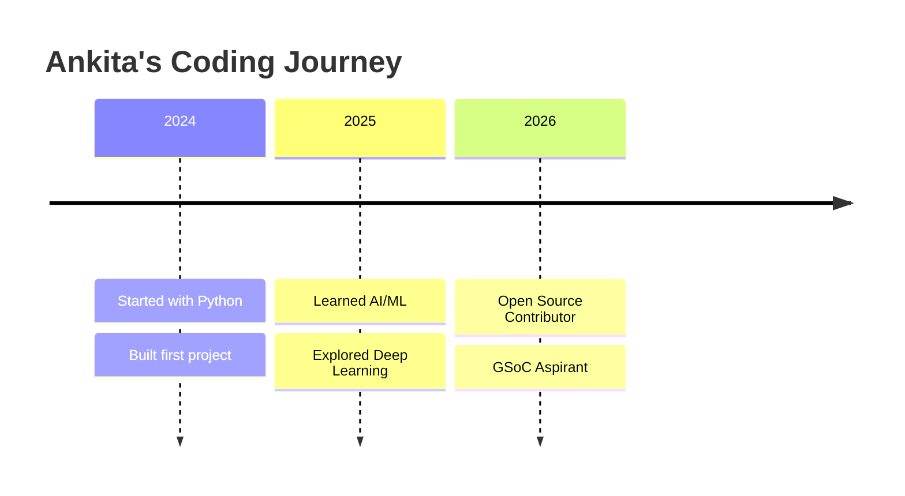

<div align="center">

<!-- ===== ANIMATED VIDEO-LIKE BANNER ===== -->
<!-- Screen recording GIF as banner -->


<!-- Alternative: Use your own GIF -->
<!-- Replace the URL below with your screen recording GIF -->
<!--  -->

</div>

---

<!-- ===== PROFILE HEADER WITH ANIMATION ===== -->
<div align="center">

<!-- Animated Name -->


</div>

---

<!-- ===== INTRO VIDEO SECTION ===== -->
### 🎬 Welcome to My World

<div align="center">

<!-- YouTube Video Embed -->
<!-- Replace VIDEO_ID with your actual YouTube video ID -->
<a href="https://youtu.be/your-video-id">
  
</a>

<!-- Or embed video directly -->
<!-- 
<div style="position: relative; padding-bottom: 56.25%; height: 0; overflow: hidden; max-width: 100%; border-radius: 12px;">
  <iframe src="https://www.youtube.com/embed/your-video-id" 
          style="position: absolute; top: 0; left: 0; width: 100%; height: 100%; border: none;" 
          allowfullscreen>
  </iframe>
</div>
-->

</div>

---

<!-- ===== SCREEN RECORDING GIF ===== -->
### 💻 My Coding Setup in Action

<div align="center">

<!-- Animated GIF showing your screen -->


</div>

---

<!-- ===== TYPING ANIMATION ===== -->
<div align="center">


</div>

---

<!-- ===== ABOUT ME ===== -->
<table>
<tr>
<td width="50%">

### 🎯 About Me

```yaml
name: "Ankita Salaria"
title: "The Code Architect"
location: "India 🇮🇳"
education: "Computer Science Student"
focus: "AI/ML & Open Source"

currently:
  learning: ["Machine Learning", "Deep Learning", "Rust"]
  building: "AI-powered applications"
  reading: "Technical papers & documentation"
  thinking: "How to make machines smarter"

philosophy: "Write code that humans can read"
```

</td>
<td width="50%">

### 📊 Quick Stats

```
┌─────────────────────────────────────┐
│  🔥 Current Streak: Building...     │
│  ⭐ Total Stars: Growing daily      │
│  📦 Repositories: Active & Clean    │
│  🎯 Focus: Quality over Quantity    │
│  ☕ Coffee Consumed: ∞              │
└─────────────────────────────────────┘
```

</td>
</tr>
</table>

---

<!-- ===== TECH STACK ===== -->
### 🛠️ Tech Arsenal

<div align="center">

<!-- Languages -->


<!-- AI/ML -->


<!-- Tools -->


</div>

---

<!-- ===== GITHUB STATS ===== -->
### 📊 GitHub Analytics

<div align="center">


&nbsp;


</div>

<div align="center">


</div>

---

<!-- ===== TROPHIES ===== -->
### 🏆 Achievements

<div align="center">


</div>

---

<!-- ===== CONTRIBUTION GRAPH ===== -->
### 📈 Contribution Activity

<div align="center">


</div>

---

<!-- ===== JOURNEY TIMELINE ===== -->
### 🗺️ My Developer Journey

<div align="center">



</div>

---

<!-- ===== CURRENT FOCUS ===== -->
### 🎯 Current Focus

<table>
<tr>
<td width="33%">

#### 📚 Learning
- Advanced ML Algorithms
- System Design
- Cloud Architecture
- Open Source Best Practices

</td>
<td width="34%">

#### 🔨 Building
- AI-powered Applications
- Open Source Contributions
- Personal Projects
- Learning Platforms

</td>
<td width="33%">

#### 🎯 Goals
- GSoC 2026
- 1000+ Contributions
- Tech Community Impact
- Knowledge Sharing

</td>
</tr>
</table>

---

<!-- ===== RANDOM DEV QUOTE ===== -->
### 💡 Daily Dev Wisdom

<div align="center">

<a href="https://github.com/Ankitavasudev">
  
</a>

</div>

---

<!-- ===== CONNECT SECTION ===== -->
### 🌐 Connect With Me

<div align="center">

<a href="https://linkedin.com/in/ankita-salaria">
  
</a>
<a href="https://twitter.com/your-handle">
  
</a>
<a href="mailto:your-email@example.com">
  
</a>
<a href="https://instagram.com/your-handle">
  
</a>
<a href="https://discord.gg/your-invite">
  
</a>

</div>

---

<!-- ===== SUPPORT ===== -->
### 💖 Support My Journey

<div align="center">

<a href="https://www.buymeacoffee.com/your-username">
  
</a>
<a href="https://github.com/Ankitavasudev">
  
</a>

</div>

---

<!-- ===== ANIMATED FOOTER ===== -->
<div align="center">

<!-- Waving Animation -->


<!-- Thank You Message -->
<h3>Thanks for visiting! ⭐</h3>

<p>
  
</p>

<!-- Visitor Counter -->


<!-- Last Updated -->
<p><i>Last updated: <a href="https://github.com/Ankitavasudev/Ankitavasudev/commits"></a></i></p>

<!-- Made with Love -->
<p>Made with ❤️ and ☕</p>

</div>
